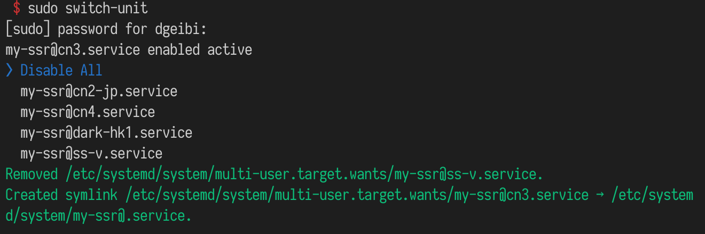

# switch-systemd-unit

[![version][version-badge]][package]

a cli tool for switching systemd unit more quickly

## Install

```sh
$ npm i -g switch-systemd-unit
```

## Usage

```sh
$ switch-unit -h

# Usage: switch-unit
#   -h, --help:     show this
#   -c, --config:   config file for options below, default: "/etc/switch-systemd-unit.json"
#   -t, --template: systemd unit template name, format: "name@.suffix"
#   --dir:          directory for reading unit instance name
#   --extname:      extname of instance files, default: ""
```



## Example

`xxxx@.service`:

```
[Unit]
Description=xxxxx
After=network.target

[Service]
Type=simple
User=nobody
ExecStart=start-sth -c /etc/my-config/%i.json

[Install]
WantedBy=multi-user.target
```

**corresponding usage**

pass arguments directly:

```sh
$ switch-unit --dir /etc/my-config --template xxxx@.service --extname .json
```

or just use JSON config `/path/to/config.json`:

```json
{
  "extname": ".json",
  "dir": "/etc/my-config",
  "template": "xxxx@.service"
}
```

```sh
$ switch-unit -c /path/to/config.json
```

## LICENSE

[ISC](LICENSE)

[version-badge]: https://img.shields.io/npm/v/switch-systemd-unit.svg
[package]: https://www.npmjs.com/package/switch-systemd-unit
